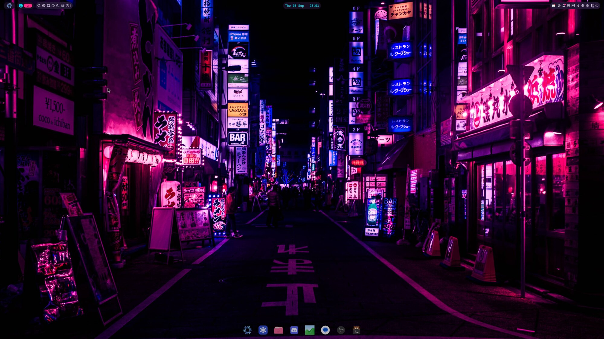
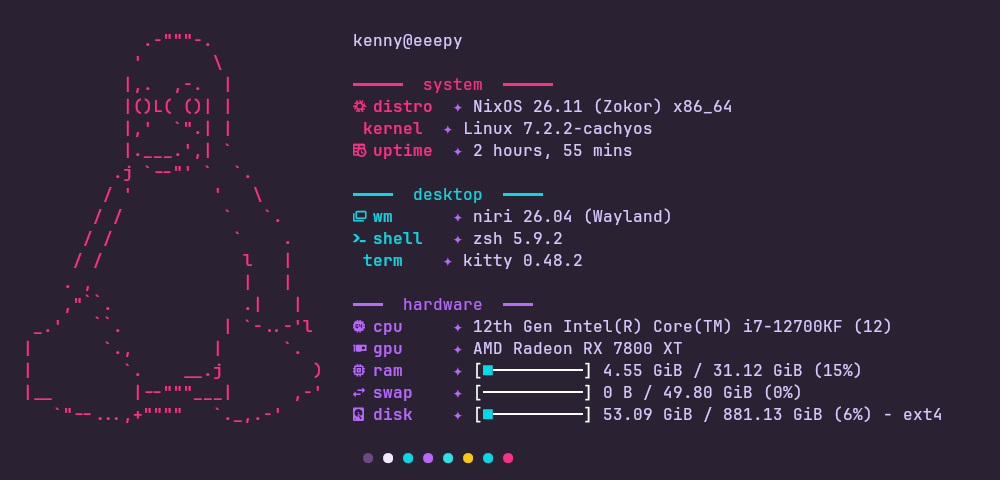
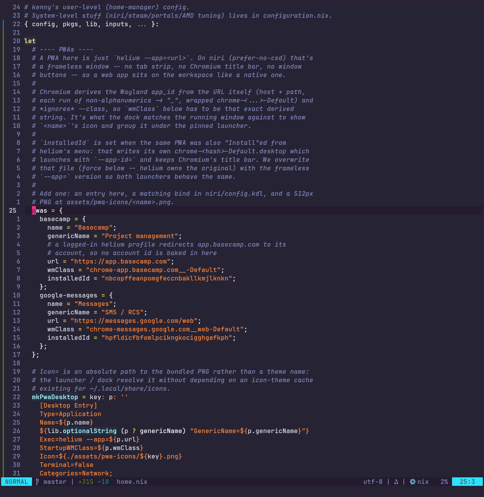
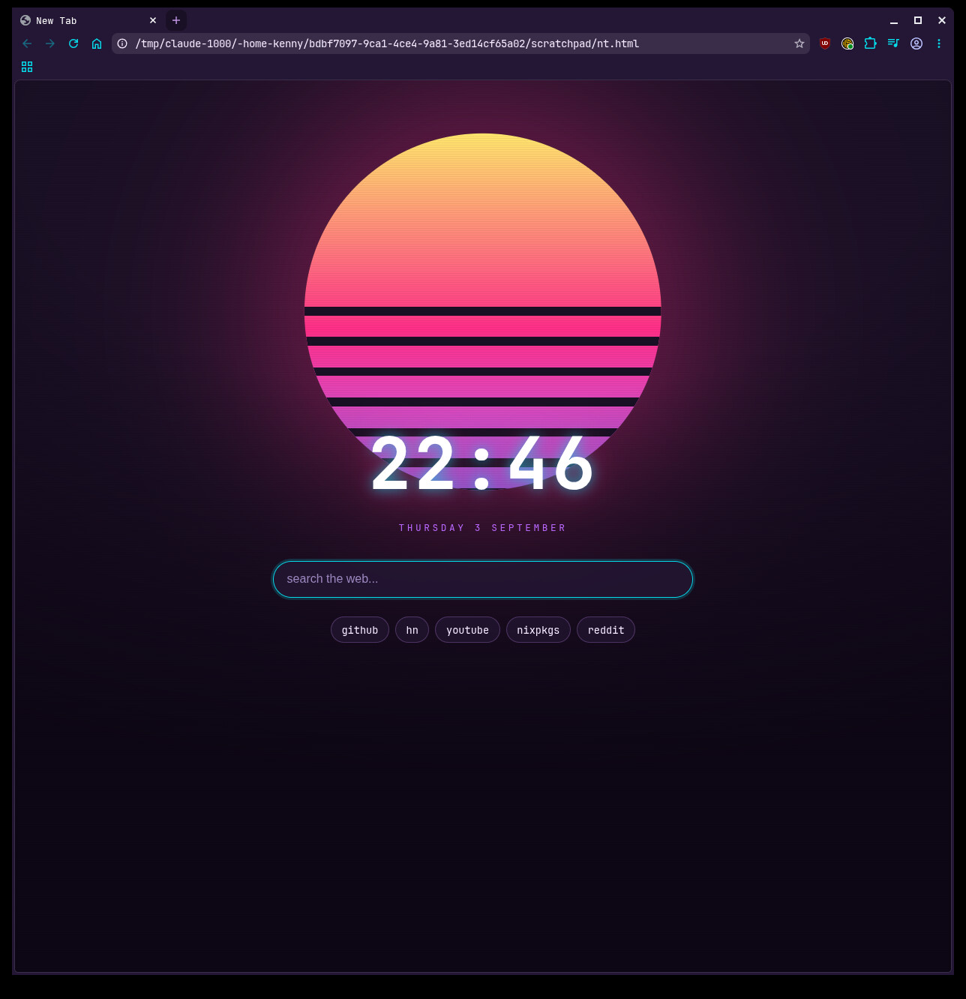
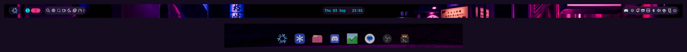

# eeepy

i built this design setup and i think it came out beautiful. if you want it,
it's yours. step-by-step install is below.

niri + noctalia, synthwave everything.



## components

| | |
|--|--|
| wm | [niri](https://github.com/YaLTeR/niri) |
| bar / dock | [noctalia](https://github.com/noctalia-dev/noctalia) |
| term | kitty |
| shell | zsh + starship, fast-syntax-highlighting, zoxide |
| editor | nvim (synthwave84, treesitter, lualine) |
| browser | helium (chromium fork, [flake](https://github.com/oxcl/nix-flake-helium-browser)) w/ a custom theme + start page |
| launcher / notifs / lock | noctalia |
| font | JetBrains Mono Nerd Font |
| kernel | cachyos (via chaotic-nyx) |
| gpu | amd rx 7800 xt, radv, vaapi |
| colors | `#1a1025` `#241736` `#ff2e88` `#05d9e8` `#b967ff` |

also riced: fastfetch, the gtk/libadwaita theme, dolphin-emu, the discord/basecamp/messages
web apps (frameless `helium --app` windows).

## shots

| | |
|--|--|
|  |  |
|  |  |

## keybinds

`Mod` = Super. `Mod+Shift+/` shows the full list in-session.

**apps**

| key | |
|--|--|
| `Mod+Return` / `Mod+T` | kitty |
| `Mod+B` | helium |
| `Mod+Shift+B` | basecamp (web app) |
| `Mod+D` | discord |
| `Mod+S` | steam |
| `Mod+Space` | launcher |
| `Alt+Tab` | window switcher |
| `Mod+Shift+,` | noctalia settings |
| `Mod+BackSpace` / `Mod+Alt+L` | lock |
| `Mod+Shift+E` / `Ctrl+Alt+Del` | quit to login |

**windows**

| key | |
|--|--|
| `Mod+←↓↑→` / `Mod+HJKL` | focus (crosses to the other monitor at the edge) |
| `Mod+Ctrl+←↓↑→` | move within workspace |
| `Mod+Q` | close |
| `Mod+F` | maximize column |
| `Mod+Shift+F` | fullscreen |
| `Mod+M` | maximize to edges |
| `Mod+C` | center column |
| `Mod+V` | float toggle |
| `Mod+W` | tabbed column toggle |
| `Mod+R` | cycle column width presets |
| `Mod+-` / `Mod+=` | width -/+ |
| `Mod+[` / `Mod+]` | pull / push window between columns |
| `Mod+,` / `Mod+.` | consume / expel window into column |

**monitors & workspaces**

| key | |
|--|--|
| `Mod+Shift+←→` | move window to other monitor |
| `Mod+Shift+Ctrl+←→` | focus other monitor |
| `Mod+1-9` | go to workspace |
| `Mod+Ctrl+1-9` | move window to workspace |
| `Mod+PgUp/PgDn` or `Mod+U/I` | prev / next workspace |
| `Mod+scroll` | switch workspace |
| `Mod+O` | overview |

**screenshots**

| key | |
|--|--|
| `Mod+Shift+S` / `Print` | region |
| `Mod+Shift+Ctrl+S` | whole screen |
| `Mod+Shift+Alt+S` | active window |

## what's where

```
flake.nix                  inputs + wiring
configuration.nix          system: boot, niri/steam/portals, amd, users, helium
hardware-configuration.nix disks (yours will differ)
home.nix                   home-manager: kitty, zsh, starship, nvim, fastfetch,
                           gtk theme, noctalia settings, web apps, dolphin
niri/config.kdl            niri binds + outputs
assets/                    wallpaper, logos, helium start page, dolphin qss
```

comments at the top of each file explain the weird choices (forced 165hz on DP-3,
cachyos, the noctalia bar layout, etc).

## install

you need a working nixos install first (any minimal one is fine). then:

**1. clone**

```sh
nix-shell -p git   # if you don't have git yet
git clone https://github.com/Coofle420/nixos-config
cd nixos-config
```

**2. use your hardware, not mine**

```sh
nixos-generate-config --show-hardware-config | sudo tee hardware-configuration.nix
```

**3. rename the host**

- `configuration.nix` → `networking.hostName = "eeepy";`
- `flake.nix` → `nixosConfigurations.eeepy = ...`

change both `eeepy` to whatever you want.

**4. build it (doesn't touch your running system)**

```sh
sudo nixos-rebuild build --flake .#eeepy      # or your host name
```

if that fails, nothing changed. fix the error and try again.

**5. switch**

```sh
sudo nixos-rebuild switch --flake .#eeepy
```

home-manager is a nixos module here, so this one command does the user side too,
no separate `home-manager switch`.

**6. after first boot**

```sh
passwd                                    # set your password
```

log out, pick niri at the login screen.

---

just want to look at it, not install:

```sh
nixos-rebuild build-vm --flake .#eeepy && ./result/bin/run-eeepy-vm
```

## notes

- run `nixos-rebuild` with sudo (as root) or nix ignores the chaotic-nyx cache
  and builds the kernel from source
- noctalia's settings gui writes `~/.local/state/noctalia/settings.toml` which
  wins over anything in `home.nix`. move keepers back into the flake
- kde plasma is installed on purpose as a fallback session if a niri change
  breaks the login
- not in here: passwords, ssh keys
